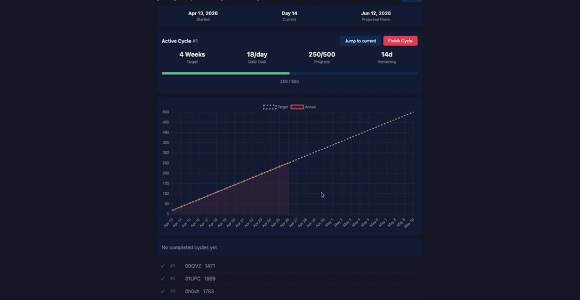

# Lichess Woodpecker

Based on [The Woodpecker Method](https://qualitychess.co.uk/products/improvement/327/the_woodpecker_method_by_axel_smith_and_hans_tikkanen/) by GMs Smith and Tikkanen.

Solve a fixed set of Lichess puzzles, then repeat it across six faster cycles: 4 weeks, 2 weeks, 1 week, 4 days, 2 days, and 1 day until the patterns become automatic. Automatically tracks and visualizes progress so you don't have to track it manually.

Lightweight and reuses Lichess's UI where possible, making it simple to clone, modify, and self-host.



**Try it here:** [https://lichess-woodpecker.onrender.com/](https://lichess-woodpecker.onrender.com/)

## Basic Guide

1. **Create a tailored puzzle set** - choose a target puzzle rating and quantity; puzzles are sampled from the Lichess database +200/-200 around that rating.
2. **Solve on Lichess** - each puzzle opens on `lichess.org/training`, while this app tracks the ones you've opened / completed.
3. **Repeat in cycles** - train the same set across faster Woodpecker cycles: 4 weeks, 2 weeks, 1 week, 4 days, 2 days, and 1 day.
4. **Review history** - see completion count, duration, and cycle progress over time.

## Local Development Setup

**Prerequisites:** Python 3.14+, Node 18+, PostgreSQL 16+, [uv](https://github.com/astral-sh/uv)

### 1. Configure environment

```bash
cp .env.example .env
```

Set `DATABASE_URL` to point at your local PostgreSQL instance. That's the only variable you need to edit — `dev.sh` fills in sensible defaults for the rest.

### 2. Install dependencies

```bash
cd backend && uv sync && cd ..
cd frontend && npm install && cd ..
```

### 3. Build the puzzle catalog

Puzzle sampling uses memory-mapped NumPy arrays built from `backend/data/puzzles.csv.zst`. Run this once (and again whenever `puzzles.csv.zst` changes):

```bash
cd backend && .venv/bin/python build_puzzle_catalog.py && cd ..
```

### 4. Run both servers

```bash
./dev.sh
```

- Frontend: `http://localhost:5173`
- API: `http://localhost:8000`

Backend hot reload is on by default; set `UVICORN_RELOAD=0` to disable.

### Production build

Build the frontend with `npm run build` in `frontend/`. The backend serves the bundle directly from `backend/static/`. For deployments, set `SESSION_SECRET` explicitly and use a stable `LICHESS_CLIENT_ID`.

## Stack

- **Backend:** FastAPI, PostgreSQL, Authlib
- **Frontend:** React, Vite, Chart.js
- **Data:** Lichess puzzle DB (stripped to ID + rating, ~32MB compressed)
