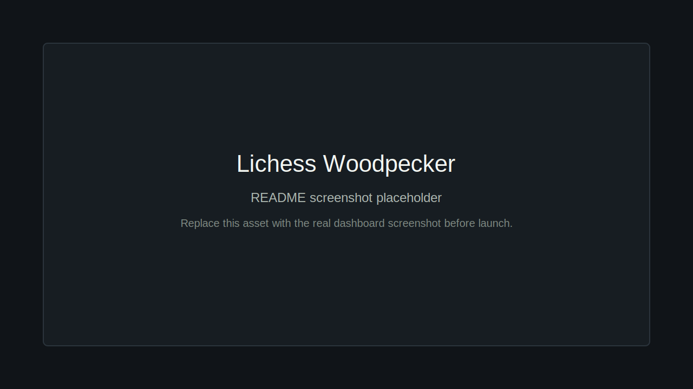

# Lichess Woodpecker

The [Woodpecker Method](https://qualitychess.co.uk/products/improvement/327/the_woodpecker_method_by_axel_smith_and_hans_tikkanen/) is chess tactics training where you solve the same puzzle set repeatedly on shorter timelines until the patterns become automatic.

Lichess Woodpecker turns the public [Lichess puzzle database](https://database.lichess.org/#puzzles) into fixed, repeatable training sets. Lichess already has excellent puzzle training; this app adds Woodpecker-specific set generation, repeated cycle scheduling, and progress history for the same puzzle list over time.



**Try it:** https://lichess-woodpecker.onrender.com/

## What it does

1. **Create a puzzle set** - choose a target rating and size; puzzles are sampled from the Lichess database around that rating.
2. **Solve on Lichess** - each puzzle opens on `lichess.org/training`, while this app tracks your fixed set.
3. **Repeat in cycles** - train the same set across faster Woodpecker cycles: 4 weeks, 2 weeks, 1 week, 4 days, 2 days, and 1 day.
4. **Review history** - see completion count, duration, and cycle progress over time.

## Setup

**Prerequisites:** Python 3.14+, Node 18+, PostgreSQL 16+, [uv](https://github.com/astral-sh/uv)

Add the required backend settings in `.env` before starting:

```bash
cp .env.example .env
```

Edit `DATABASE_URL` for your local PostgreSQL instance. `dev.sh` defaults `APP_BASE_URL` to `http://localhost:5173`, `SESSION_SECRET` to `dev-session-secret`, and `LICHESS_CLIENT_ID` to `lichess-woodpecker-local` if they are not set. In production, set `SESSION_SECRET` explicitly and use a stable `LICHESS_CLIENT_ID` for the deployment.

```bash
# Install dependencies
cd backend && uv sync && cd ..
cd frontend && npm install && cd ..

# Build the compact puzzle catalog (one-time or after puzzles.csv.zst changes)
cd backend && .venv/bin/python build_puzzle_catalog.py && cd ..

# Run both servers
./dev.sh
```

The app runs at `http://localhost:5173` (frontend) with the API at `http://localhost:8000`.
`./dev.sh` enables FastAPI hot reload for the backend by default. Set `UVICORN_RELOAD=0` if you need to disable it.
Puzzle sampling uses memory-mapped NumPy arrays built from `backend/data/puzzles.csv.zst`, so build the compact catalog before creating sets.

For production, build the frontend (`npm run build` in `frontend/`) and the backend serves it directly from `backend/static/`.

## Lichess API and data use

- OAuth uses PKCE with no explicit scope, because the app only needs the signed-in account identity from `/api/account`.
- Outbound Lichess API requests include a descriptive `User-Agent`.
- Lichess asks API clients to make one request at a time and wait at least one minute after a `429`; the app surfaces upstream rate limits instead of retrying aggressively.
- Puzzle metadata comes from the downloadable public puzzle database, not from scraping Lichess pages.

Relevant docs: [Lichess API tips](https://lichess.org/page/api-tips), [Lichess API reference](https://github.com/lichess-org/api/blob/master/doc/specs/lichess-api.yaml), and [Lichess puzzle database](https://database.lichess.org/#puzzles).

## Render

After the production build refactor, `backend/` is the deploy root on Render.

- **Runtime:** `Python 3`
- **Root Directory:** `backend`
- **Build Command:** `cd ../frontend && npm ci && npm run build && cd ../backend && uv sync && .venv/bin/python build_puzzle_catalog.py`
- **Start Command:** `uv run python main.py`

Set `DATABASE_URL` from a Render Postgres instance, set `APP_BASE_URL` to `https://lichess-woodpecker.onrender.com`, and set a production `SESSION_SECRET`.

## Stack

- **Backend:** FastAPI, PostgreSQL, NumPy
- **Frontend:** React, Vite, Chart.js
- **Data:** Lichess puzzle DB (stripped to ID + rating, ~32MB compressed)
